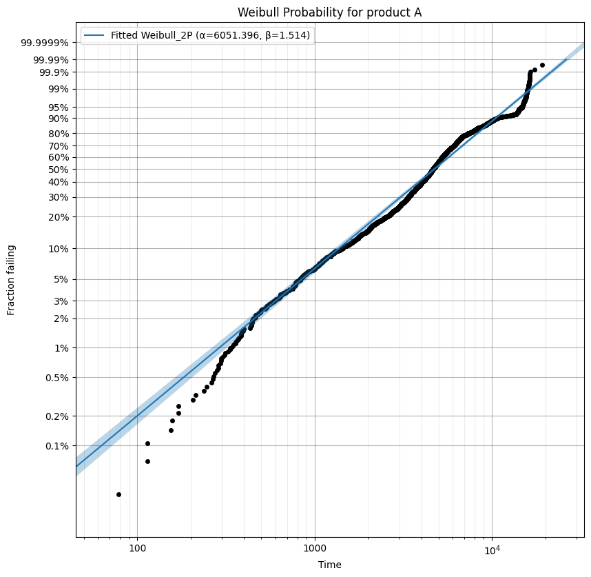
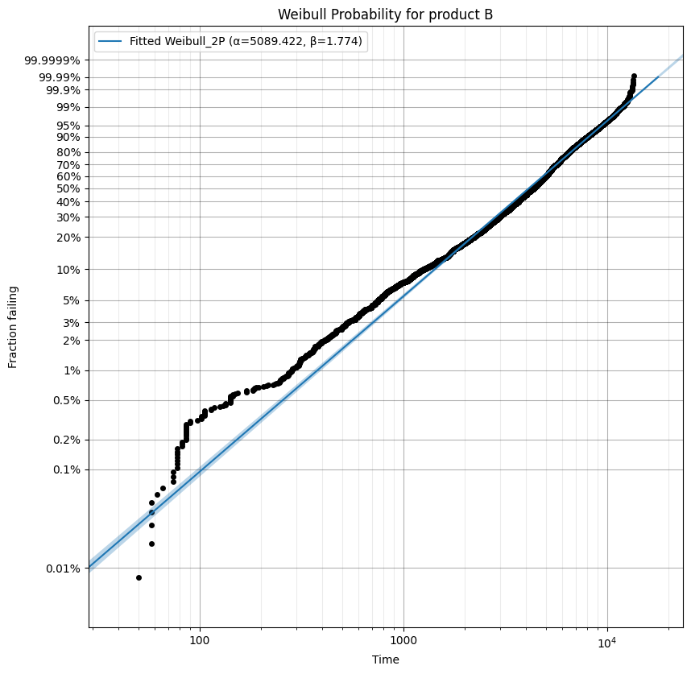
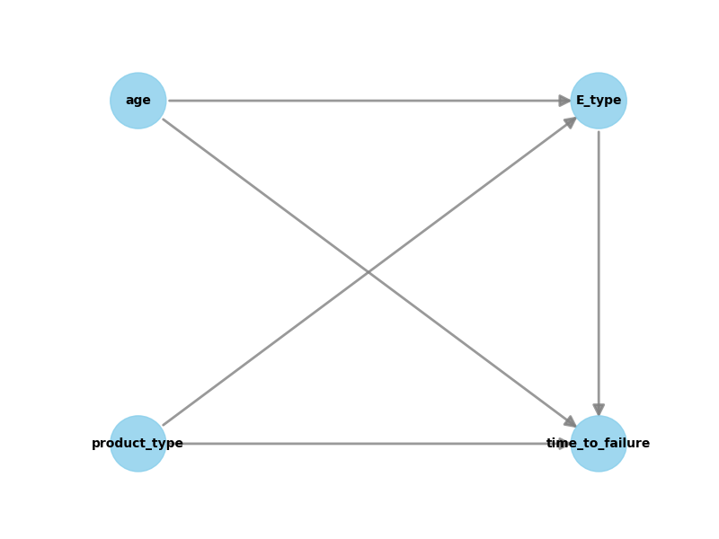
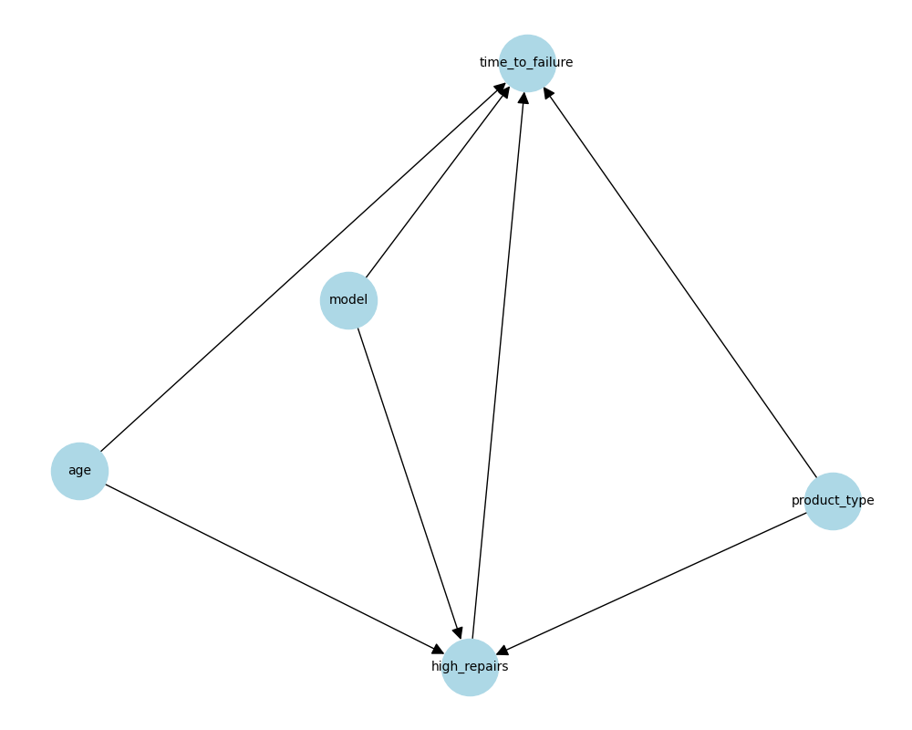

# Project Report

## Introduction

- **Context**: Analysis of power supply repair center data to evaluate product reliability and maintenance effectiveness. The dataset includes product types A and B with various design iterations of components V and E.

- **Objectives**:
  1. Estimate reliability metrics for products A and B
  2. Evaluate the impact of component E's new design on product lifetime
  3. Assess the quality and effectiveness of maintenance repairs

## Data Description

### Dataset Overview
The dataset contains real-world data from a company's power supply repair center, with confidential information removed and values rescaled. Key features include:

- **Series Number**: Unique identifier for each product
- **Product Type**: Two categories (A/B) representing different component types
- **Model**: Product variants (V1E1, V1E2, V1E3, V2E1, V2E3)
  - V and E represent key components
  - Higher numbers indicate more recent design iterations
- **Repair Operation Information**:
  - Repair operation number: Sequential index of repairs
  - Previous repair operation number:
    - "MFG" for first-time repairs
    - Previous repair number for subsequent repairs

### Field Operation Process
When a product fails in the field, it is replaced and returned for repair, creating a cycle of repair and redeployment.

## Task 1: Estimating Product Reliability

### Methodology
To estimate the reliability of products A and B, we employed Weibull analysis, which is particularly suitable for reliability and lifetime data analysis. The process involved:

1. Data preprocessing to separate failures by product type
2. Creating Weibull probability plots to assess fit and estimate parameters

### Results

#### Weibull Analysis
The Weibull probability plots for both products are shown below:

{width=45%} {width=45%}

The analysis revealed:

- **Product A**:
  - Shape parameter ($\beta$): 1.514
  - Scale parameter ($\alpha$): 6051 hours
  - Good linearity in the probability plot indicating Weibull distribution fit

- **Product B**:
  - Shape parameter ($\beta$): 1.774
  - Scale parameter ($\alpha$): 5089 hours
  - Good linearity in the probability plot indicating Weibull distribution fit

### Discussion

The analysis shows that both products' failure patterns can be modeled using Weibull distributions, with their respective parameters estimated from the probability plots. Further statistical analysis would be needed to draw conclusions about reliability comparisons between the products.

## Task 2: Impact of New Design of Component E

### Variables Description
- **Treatment Variable**: Component type (E1, E2, or E3)
  - Represents different design iterations of component E
  - Categorical variable extracted from the model number
- **Outcome Variable**: Time to failure (hours)
  - Continuous variable measuring time between repairs
- **Confounding Variables**:
  - Product type (A/B)
  - Age after repair
  - These variables potentially influence both the treatment assignment and outcome

### Causal Graph and Methodology
We employed the DoWhy framework for causal inference analysis. The causal relationships are represented in the following graph:

{width=50%}

\pagebreak
The analysis involved:

1. Creating a causal graph representing relationships between variables
2. Using propensity score stratification to control for confounders
3. Applying backdoor adjustment method
4. Performing robustness checks using random common cause refutation

### Results and Quick Conclusion
The causal analysis revealed:

1. **E1 vs E2 Comparison**
   - Effect: -1,479 hours (E2 fails earlier)
   - Robust estimate (p-value = 1.0)

2. **E2 vs E3 Comparison**
   - Effect: -1,765 hours (E3 fails earlier)
   - Robust estimate (p-value = 1.0)

3. **E1 vs E3 Comparison**
   - Effect: -3,186 hours (E3 fails earlier)
   - Robust estimate (p-value = 1.0)

### Discussion
Contrary to expectations, newer iterations of component E show progressively worse reliability. E1 (original design) demonstrates the best performance, while E3 (newest design) shows significantly shorter time to failure. This suggests a need to review the design changes implemented in newer versions.

## Task 3: The Quality of Maintenance

### Variables Description
- **Treatment Variable**: High repair count (binary)
  - Defined as products with repair counts above the median
  - Represents products that underwent frequent repairs
- **Outcome Variable**: Time to failure (hours)
  - Continuous variable measuring time between repairs
  - Indicator of product reliability post-repair
- **Confounding Variables**:
  - Product type (A/B)
  - Model type
  - Age after repair
  - These variables might influence both repair frequency and failure rates

### Causal Graph and Methodology
We developed a causal model using the DoWhy framework to analyze how multiple repairs affect product reliability. The causal relationships are visualized in the following graph:

{width=50%}

The analysis methodology included:

1. Creating a binary treatment variable based on repair frequency
2. Developing a causal graph incorporating confounding variables
3. Using propensity score stratification to control for confounders
4. Applying backdoor adjustment method
5. Conducting multiple robustness checks

### Results

The causal analysis revealed several key findings:

1. **Causal Effect Estimation**:
   - Estimated effect: -2,327 hours
   - This indicates that products with high repair counts (above median) experience failures approximately 2,327 hours earlier than those with fewer repairs
   - The negative effect suggests that frequent repairs are associated with decreased reliability

2. **Robustness Analysis**:
   - Random common cause refutation validated the findings (p-value = 1.0)
   - The estimated effect remained stable under the robustness check
   - This suggests the causal relationship is robust and not due to random chance

3. **Average Time to Failure Comparison**:
   - Low repair count group (below median): 5,477 hours
   - High repair count group (above median): 3,677 hours
   - The difference of approximately 1,800 hours supports the causal effect finding
   - This raw comparison aligns with the direction of the causal effect, though the magnitude differs due to controlling for confounders in the causal analysis

### Discussion

The analysis suggests that the number of repairs a product undergoes has a measurable impact on its reliability. Key observations include:

1. **Repair Frequency Impact**:
   - Products with above-median repair counts showed different reliability patterns
   - The relationship between repair count and reliability appears to be causal rather than merely correlational

2. **Maintenance Quality Implications**:
   - The findings suggest potential areas for improvement in maintenance procedures
   - The causal relationship between repair frequency and reliability indicates a need for reviewing repair protocols

3. **Limitations and Considerations**:
   - The binary treatment approach (high/low repair count) may oversimplify complex repair patterns
   - Additional confounding factors might exist beyond those included in the model

---
